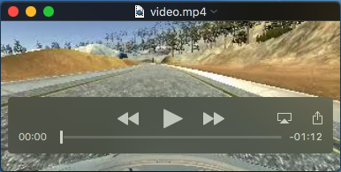

# Behavioral Cloning

---

## Model Architecture and Training Strategy

### Solution Design Approach

This solution tries to implement the model presented in the paper ["End to End Learning for Self-Driving Cars"](https://arxiv.org/abs/1604.07316)

The network consists of 9 layers, including a normalization layer, 5 convolutional layers and 3 fully connected layers

The cameras in the simulator capture 160 pixel by 320 pixel images. As not all of these pixels contain useful information, the top and bottom portion of the image are removed.


#### Reduce overfitting in the model

Multiple attempts have been made to include Dropout layers in the model:

- Add Dropout at the end of the Convolutional layer
- Add Dropout layers between Dense layers

Both approaches reduced the overfitting on the model but also reduced the performance of the simulation.

The best approach found to reduce the overfitting in the model was to limit the number of epoch during the training. A total of five epoch shows a good balance between overfitting and underfitting during training/validation and a good performance of the simulation.


#### Final Model Architecture

The final model architecture consisted of a convolution neural network with the following layers and layer sizes:

```
____________________________________________________________________________________________________
Layer (type)                     Output Shape          Param #     Connected to
====================================================================================================
lambda_1 (Lambda)                (None, 160, 320, 3)   0           lambda_input_1[0][0]
____________________________________________________________________________________________________
cropping2d_1 (Cropping2D)        (None, 80, 320, 3)    0           lambda_1[0][0]
____________________________________________________________________________________________________
convolution2d_1 (Convolution2D)  (None, 38, 158, 24)   1824        cropping2d_1[0][0]
____________________________________________________________________________________________________
convolution2d_2 (Convolution2D)  (None, 17, 77, 36)    21636       convolution2d_1[0][0]
____________________________________________________________________________________________________
convolution2d_3 (Convolution2D)  (None, 7, 37, 48)     43248       convolution2d_2[0][0]
____________________________________________________________________________________________________
convolution2d_4 (Convolution2D)  (None, 5, 35, 64)     27712       convolution2d_3[0][0]
____________________________________________________________________________________________________
convolution2d_5 (Convolution2D)  (None, 3, 33, 64)     36928       convolution2d_4[0][0]
____________________________________________________________________________________________________
flatten_1 (Flatten)              (None, 6336)          0           convolution2d_5[0][0]
____________________________________________________________________________________________________
dense_1 (Dense)                  (None, 100)           633700      flatten_1[0][0]
____________________________________________________________________________________________________
dense_2 (Dense)                  (None, 50)            5050        dense_1[0][0]
____________________________________________________________________________________________________
dense_3 (Dense)                  (None, 10)            510         dense_2[0][0]
____________________________________________________________________________________________________
dense_4 (Dense)                  (None, 1)             11          dense_3[0][0]
====================================================================================================
Total params: 770,619
____________________________________________________________________________________________________
```

####  Model parameter tuning

The model used an [Adam optimizer](https://arxiv.org/abs/1412.6980), so the learning rate was not tuned manually.

### Training Set

The [Sample Training Data](https://d17h27t6h515a5.cloudfront.net/topher/2016/December/584f6edd_data/data.zip) from the Project Resources was used for the training.

Only the central camera images were needed to achieve good results.

The model use 90% of the data to perform the training, 10% for validation and zero for testing.

The testing process was done directly on the simulator.

### Training Process

The training was performed on an AWS GPU instance for a total of five epochs.

```
Epoch 1/5
7232/7232 [==============================] - 16s - loss: 0.0115 - val_loss: 0.0095
Epoch 2/5
7232/7232 [==============================] - 15s - loss: 0.0096 - val_loss: 0.0094
Epoch 3/5
7232/7232 [==============================] - 15s - loss: 0.0091 - val_loss: 0.0093
Epoch 4/5
7232/7232 [==============================] - 15s - loss: 0.0088 - val_loss: 0.0094
Epoch 5/5
7232/7232 [==============================] - 15s - loss: 0.0085 - val_loss: 0.0092
```

## Autonomous Simulation

At the end of the process, the vehicle is able to drive autonomously around the track without leaving the road.

The following video shows two laps from the front facing camera of the car:

[](video.mp4)


## Known Issues

### Oscillations at high speeds

The model displays a poor steering control at high speeds, overshoots on the steering control induce the car to oscillate out of control. This control problem may be caused by the delay on the steering induced by the model evaluation.
